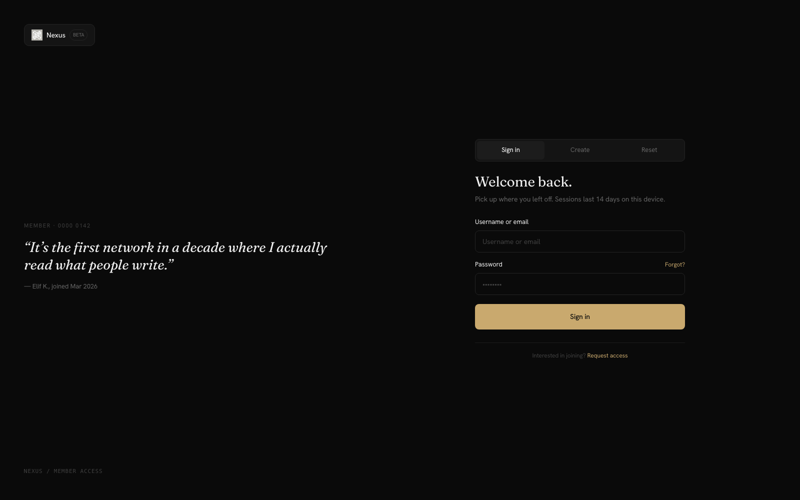
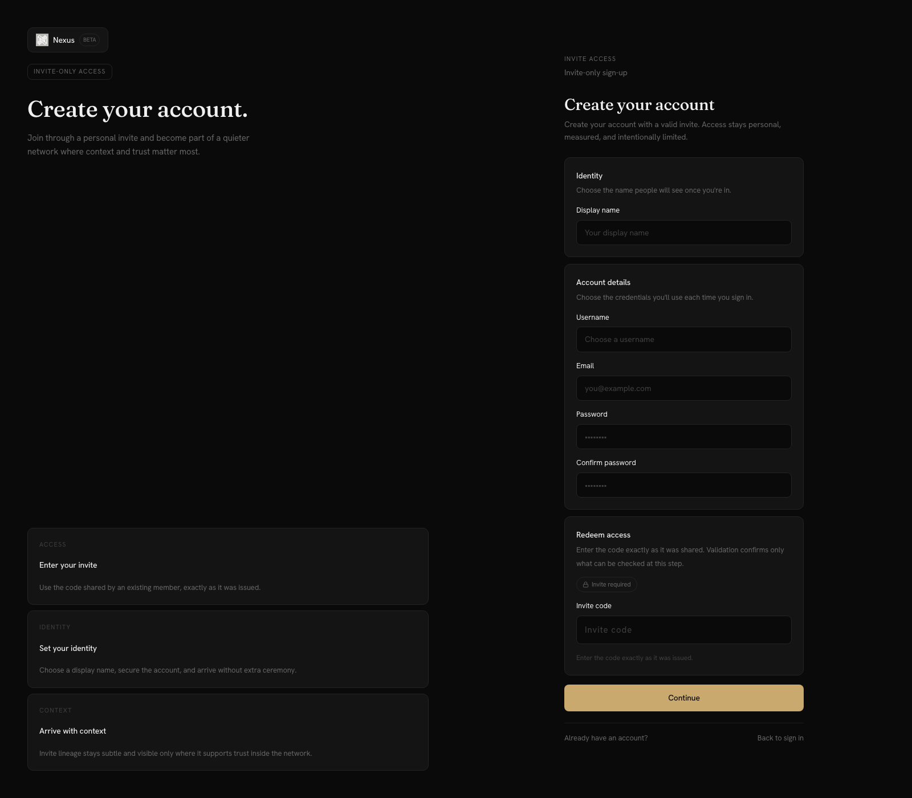
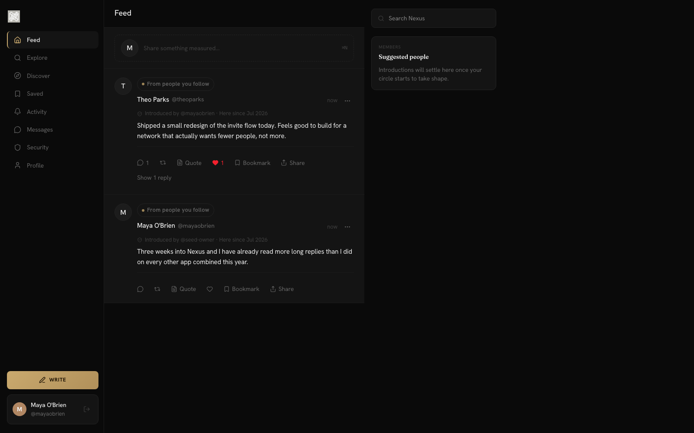
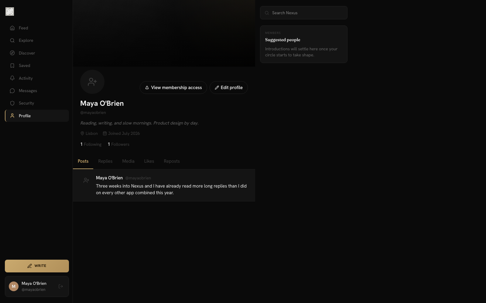

# Nexus

Invite-only social platform built with a security-first mindset. FastAPI backend, Next.js frontend, fully containerized deployment.

> Built as a deep-dive into authentication, session management, and platform hardening — the defensive side of the skills I'm building toward offensive security work.

## Screenshots

<table>
  <tr>
    <td width="50%"></td>
    <td width="50%"></td>
  </tr>
  <tr>
    <td align="center"><sub>Sign in</sub></td>
    <td align="center"><sub>Invite-only registration</sub></td>
  </tr>
  <tr>
    <td width="50%"></td>
    <td width="50%"></td>
  </tr>
  <tr>
    <td align="center"><sub>Feed</sub></td>
    <td align="center"><sub>Profile</sub></td>
  </tr>
</table>

Dark, editorial theme — [Fraunces](https://fonts.google.com/specimen/Fraunces) for display type paired with [Hanken Grotesk](https://fonts.google.com/specimen/Hanken+Grotesk) for UI/body text, self-hosted via `next/font`.

## Architecture

```
┌─────────────┐     ┌──────────────┐     ┌──────────────┐
│   Next.js    │────▶│   FastAPI    │────▶│  PostgreSQL  │
│   (web/)     │     │  (backend/)  │     │              │
└─────────────┘     └──────┬───────┘     └──────────────┘
       ▲                   │
       │                   ▼
┌──────┴──────┐     ┌──────────────┐
│    Caddy    │     │    Redis     │
│ (reverse    │     │ (rate limit, │
│  proxy)     │     │  sessions)   │
└─────────────┘     └──────────────┘
```

- **`backend/`** — FastAPI app: routes, services, SQLAlchemy models, 39 Alembic migrations
- **`web/`** — Next.js frontend: dark design system, feed, discover, DMs
- **`deploy/`** — Docker Compose, Caddy configs, DB init scripts
- **`.github/workflows/`** — CI with live PostgreSQL + Redis services

## Security Features

This is where most of the engineering effort went:

| Area | Implementation |
|------|----------------|
| **Authentication** | JWT access + refresh tokens, WebAuthn (passkeys), MFA enforcement on privileged sessions |
| **Session hardening** | Refresh token rotation, device fingerprinting, timezone-stable token timestamps |
| **Invite system** | Hashed invite codes, usage auditing, wave campaigns with concurrency-safe redemption |
| **Rate limiting** | Redis-backed, hardened against proxy/cache bypass |
| **Account security** | Email canonicalization, signup idempotency, password reset + email change token flows |
| **Authorization** | Staff permission system with audit logging, secure admin actions (MFA-gated) |
| **Moderation** | Signal intake, moderation queue, user blocks, media moderation |

**Production config validation:** `Settings()` fails fast on startup if it detects production-unsafe values — a weak `SECRET_KEY`, a `localhost`-origin CORS entry, a wildcard `ALLOWED_HOSTS`, or an unauthenticated Redis URL. If you deploy with `APP_ENV=production` and see:

> `Redis must use authentication and TLS in production. Set REDIS_URL to rediss://:password@host:port/db`

it means `REDIS_URL` is still using the local-dev `redis://host:port/db` form. Switch it to `rediss://:yourpassword@your-redis-host:6379/0` (TLS scheme + credentials) and restart.

## Testing

40+ test modules, heavily weighted toward security behavior:

- `test_privileged_session_mfa_enforcement` — MFA required for sensitive operations
- `test_rate_limit_hardening` / `test_proxy_and_cache_hardening` — bypass resistance
- `test_webauthn_auth_source_of_truth` — passkey auth integrity
- `test_phase3_wave_campaign_concurrency` — race-condition safety on invite redemption
- Migration tests for every security-relevant schema change

```bash
cd backend
./scripts/bootstrap_test_env.sh
pytest
# security-focused subset:
./scripts/run_targeted_security_tests.sh
```

## Running Locally

```bash
# 1. Configure
cp backend/.env.example backend/.env
cp deploy/.env.local-smoke.example deploy/.env

# 2. Start everything (Postgres, Redis, backend, frontend, Caddy)
./deploy/scripts/docker-start.sh

# 3. Reset DB + restart from scratch
./deploy/scripts/docker-reset-and-start.sh
```

## Invite-Only Registration (Local Testing)

Nexus is invite-only — `/register` requires a valid invite code, and a fresh database has none. `ENABLE_BOOTSTRAP_ADMIN` is `false` by default (correct for a normal run), so out of the box you cannot sign up. To test registration locally, pick one:

**Option A — generate an invite code directly (no config changes, no restart):**

`invite_codes.created_by_id` is `NOT NULL`, so on a completely fresh database (no users yet) the script below creates a minimal, non-staff placeholder user to own the invite; on a database that already has a user, it reuses the first one instead.
```bash
docker exec x-backend python -c "
import asyncio, secrets, string
from datetime import datetime, timedelta, timezone
from app.main import app as _app  # ensures all models/routers are registered
from app.core.database import AsyncSessionLocal
from app.core.datetime_utils import to_naive_utc_datetime
from app.core.security import hash_invite_code, get_password_hash
from app.models.invite import InviteCode, InviteType
from app.models.user import User, UserStatus
from sqlalchemy import select

async def main():
    async with AsyncSessionLocal() as db:
        creator = await db.scalar(select(User).limit(1))
        if creator is None:
            now = to_naive_utc_datetime(datetime.now(timezone.utc))
            creator = User(
                username='seed-owner', email='seed-owner@nexus.local',
                password_hash=get_password_hash(secrets.token_urlsafe(32)),
                display_name='Seed Owner', created_at=now, is_active=True,
                must_change_password=True, email_verified_at=now, status=UserStatus.ACTIVE,
            )
            db.add(creator)
            await db.flush()
        code = ''.join(secrets.choice(string.ascii_letters + string.digits) for _ in range(32))
        db.add(InviteCode(
            code=code, code_hash=hash_invite_code(code), invite_type=InviteType.GENERIC,
            created_by_id=creator.id, max_uses=1, current_uses=0,
            expires_at=datetime.now(timezone.utc) + timedelta(days=30), is_active=True,
        ))
        await db.commit()
        print('INVITE_CODE=' + code)

asyncio.run(main())
"
```
Use the printed code on the `/register` page.

**Option B — bootstrap a temporary admin account** to create invites (and access `/admin`) through the normal flow:
1. In `deploy/.env.docker`, set `APP_ENV=development` (or `test`/`local`) and `ENABLE_BOOTSTRAP_ADMIN=true`, then fill in `BOOTSTRAP_ADMIN_USERNAME` / `BOOTSTRAP_ADMIN_EMAIL` / `BOOTSTRAP_ADMIN_PASSWORD` (16+ chars, not a dictionary phrase) / `BOOTSTRAP_ADMIN_DISPLAY_NAME`. `ENABLE_BOOTSTRAP_ADMIN` is rejected unless `APP_ENV` is a non-production value — see `backend/app/core/config.py`.
2. Restart: `./deploy/scripts/docker-start.sh`.
3. **Note:** admin/staff accounts cannot sign in with just a password — a WebAuthn security key is required (`app/api/routes/auth.py`), and there is currently no frontend page wired up to the backend's `ENABLE_ADMIN_WEBAUTHN_RECOVERY` flow to register the first one. In practice, use the bootstrap admin's `user.id` from the backend logs with Option A's script (set `created_by_id=<id>`) rather than trying to log in as that account through the UI.
4. Set `APP_ENV` and `ENABLE_BOOTSTRAP_ADMIN` back to `production` / `false` afterward — don't ship a local-smoke config with bootstrap admin enabled.

## Email Delivery

Nexus sends transactional email for signup verification, password reset, and email-change confirmation. The provider is controlled by `MAIL_PROVIDER` and defaults to `capture`:

- **`capture` (default, used for local/dev)** — no real email is sent and no external service is required. Each outgoing message is written as a JSON file (subject, body, and the verification/reset link) to `MAIL_CAPTURE_DIR` (default `tmp/mail`). In the Docker smoke stack that directory isn't writable by the app user, so it automatically falls back to `/tmp/nexus-mail-capture/tmp/mail` inside the container (a warning is logged when this happens). Read the latest captured email to get a working verification link during local testing:
  ```bash
  docker exec x-backend sh -c '
    dir=tmp/mail; [ -d /tmp/nexus-mail-capture/tmp/mail ] && dir=/tmp/nexus-mail-capture/tmp/mail
    ls -t "$dir" | head -1 | xargs -I{} cat "$dir/{}"
  '
  ```
- **`resend`** — sends real email through [Resend](https://resend.com). Requires `RESEND_API_KEY`, plus a real `MAIL_FROM_EMAIL`/`MAIL_FROM_NAME` and a production `WEB_BASE_URL` (a `.local`/`.localtest.me` base URL is rejected when a real provider is configured).

Keep `MAIL_PROVIDER=capture` for any local or smoke-test stack — registration, password reset, and email-change all work end-to-end without a real mail service. Only switch to `resend` (and supply `RESEND_API_KEY`) for the actual deployed environment.

## Stack

**Backend:** Python · FastAPI · SQLAlchemy + Alembic · PostgreSQL · Redis · pytest
**Frontend:** TypeScript · Next.js · Tailwind
**Infra:** Docker Compose · Caddy · GitHub Actions

## Status

Active development. Invite-only beta architecture — waitlist, invite campaigns, and moderation tooling are functional; feature surface still expanding.
